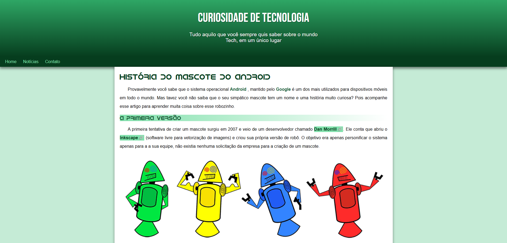
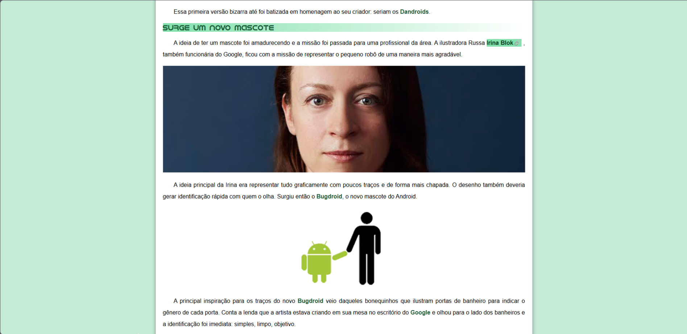
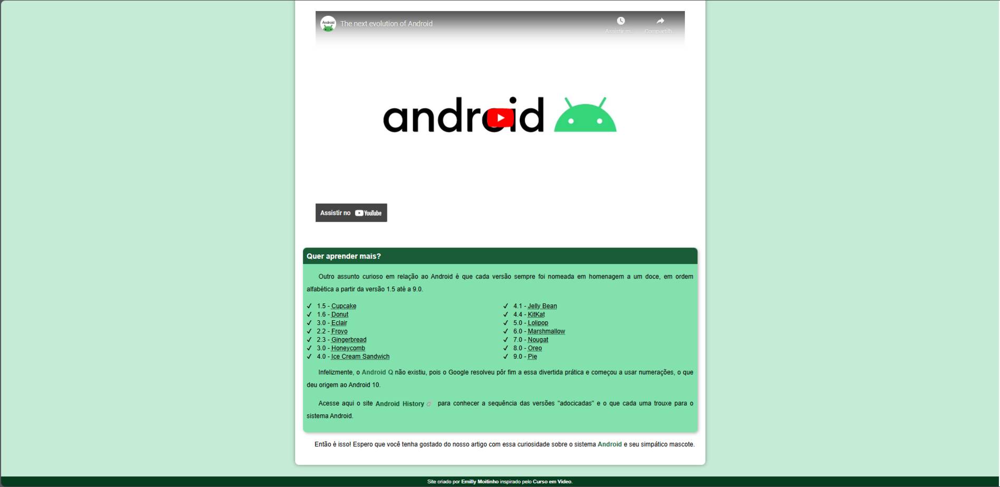

# Curiosidade de Tecnologia 💻

Bem-vindo ao repositório "Curiosidade de Tecnologia"! Este projeto foi desenvolvido como parte do curso de HTML5 e CSS3 oferecido pelo [Curso em Vídeo](https://www.cursoemvideo.com/) e ministrado pelo professor Gustavo Guanabara.

O objetivo deste projeto é criar um site responsivo e utilizar todos os estudos aprendidos durante o curso.

## História do Mascote do Android 

Este artigo explora a origem e a evolução do mascote do sistema operacional Android, desde as primeiras tentativas de criação até a versão final conhecida como Bugdroid.

## Imagens do Projeto 

## Tecnologias Utilizadas

- **HTML5**: Utilizado para estruturar o conteúdo do site.
- **CSS3**: Utilizado para estilizar e layoutar o site.

## Responsividade

O site "Curiosidade de Tecnologia" é totalmente responsivo, garantindo uma boa experiência de navegação em dispositivos móveis, tablets e desktops. A responsividade foi implementada utilizando técnicas de design responsivo, assegurando que o conteúdo se adapte de maneira fluida a diferentes tamanhos de tela.

## Créditos

Este projeto foi criado por Emilly Moitinho, com inspiração do Curso em Vídeo do professor Gustavo Guanabara.

---

